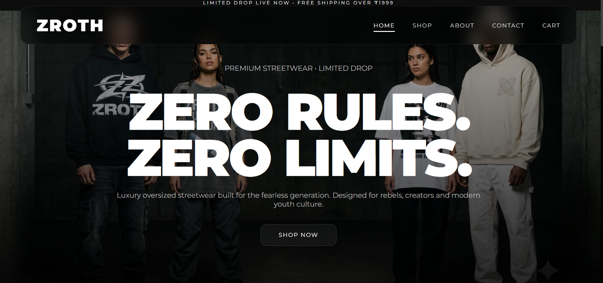
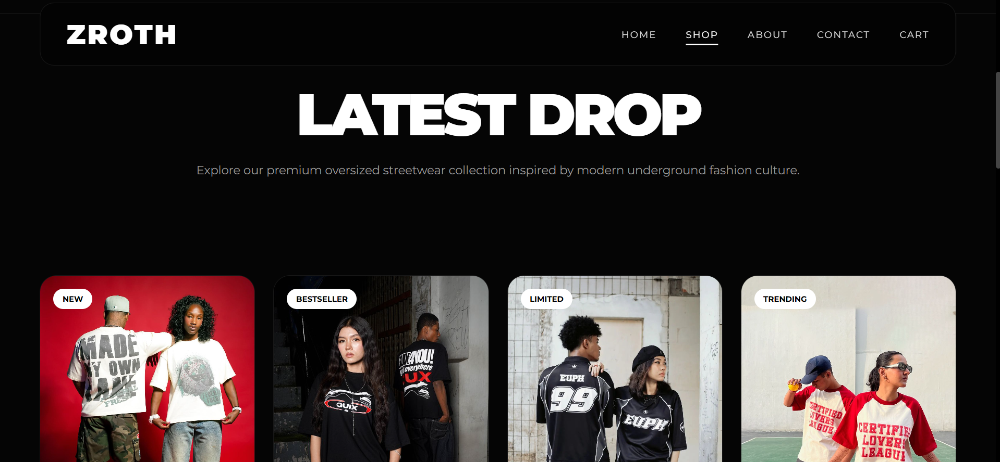
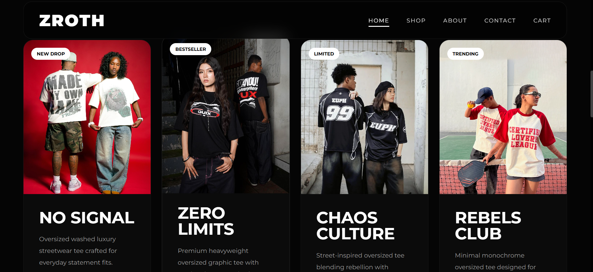
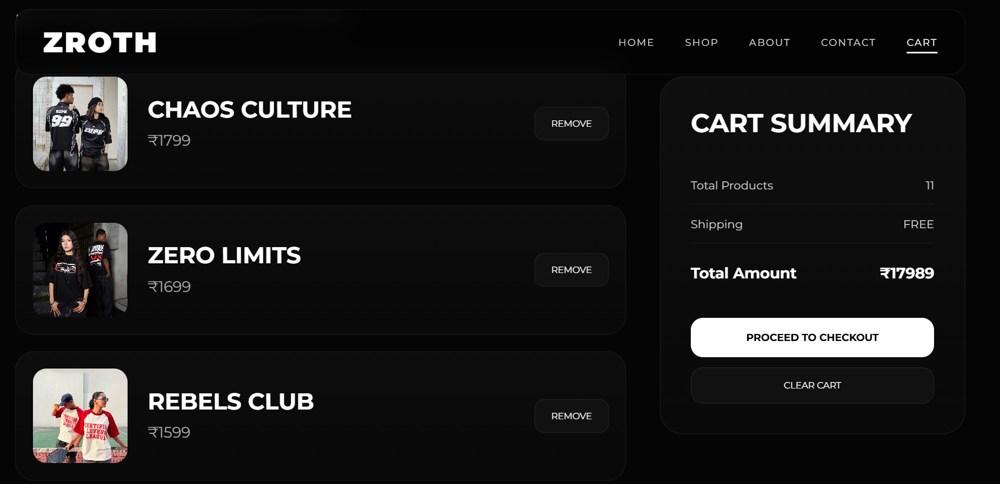
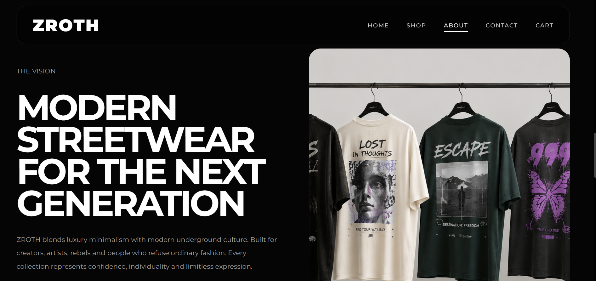
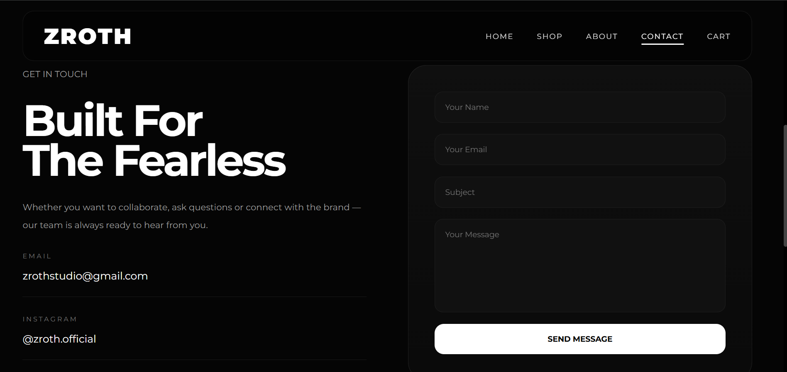

# ZROTH

<div align="center">

### Zero Rules. Zero Limits.

Premium Gen-Z Streetwear Fashion Website built with HTML, CSS & JavaScript.

</div>

---

# Preview

ZROTH is a luxury-inspired streetwear e-commerce frontend focused on modern Gen-Z fashion aesthetics, oversized culture, smooth interactions, and responsive user experience.

---

# 📸 Screenshots

## 🏠 Home Page


---

## 🛍 Shop Page


---

## 👕 Product Page


---

## 🛒 Cart Page


---

## ℹ️ About Page


---

## 📩 Contact Page


---

# Features

## Premium UI/UX
- Dark luxury streetwear aesthetic
- Modern typography and layouts
- Smooth hover interactions
- Responsive design across devices
- Editorial-inspired visuals

## Shopping Experience
- Dynamic product pages
- Quick View functionality
- Size selection system
- Add to Cart functionality
- LocalStorage cart persistence
- Product detail rendering
- Cart management system

## Responsive Design
- Mobile optimized layouts
- Tablet responsive UI
- Adaptive grids and typography
- Optimized product cards

## Interactive Elements
- Smooth animations
- Custom notifications
- Animated marquee sections
- Hover effects and transitions
- Interactive product previews

---

# Tech Stack

| Technology | Purpose |
|---|---|
| HTML5 | Structure |
| CSS3 | Styling & Responsive Design |
| JavaScript | Interactivity & Cart Logic |
| LocalStorage API | Cart Persistence |

---

# Project Structure

```bash
ZROTH/
│
├── assets/
│   ├── hero.jpg
│   ├── banner.jpg
│   ├── model1.jpg
│   ├── product1.jpg
│   └── ...
│
├── screenshots/
│   ├── home.png
│   ├── shop.png
│   ├── product.png
│   └── cart.png
│
├── css/
│   ├── style.css
│   ├── responsive.css
│   └── animations.css
│
├── js/
│   └── app.js
│
├── index.html
├── shop.html
├── product.html
├── about.html
├── contact.html
├── cart.html
└── README.md
